```{r}
#| include: FALSE
#| eval: true

set.seed(0)

library(tidyverse)

library(gt) # for tables
```


```{r eval=FALSE, echo=FALSE}
# re-run to update references
# re-run to update citations
# remotes::install_github("paleolimbot/rbbt")
keys <- rbbt::bbt_detect_citations(path = "ch2_main.qmd")
ignore <- c("^fig-", "^tbl-", "^sec-")
for (pt in ignore) {
  keys <- grep(pt, keys, invert = TRUE, value = TRUE)
}
rbbt::bbt_write_bib(keys = keys, path = "references.bib", overwrite = TRUE, library_id = rbbt::bbt_library_id("CSAFE"), translator = "bibtex")
```


# Background \& Summary {#sec-background-summary .unnumbered}


In forensic analysis, marks left at crime scenes play an important role, and forensic examiners are particularly interested in identifying their origin, a process known as the Source Identification Problem in Forensic Science [@lindleyProblemForensicScience1977].
The forensic science community focuses on two distinct problems: the **specific source problem**, in which examiners aim to determine whether a mark was left by a particular tool, and the **common source problem**, in which examiners aim to determine whether two marks were left by the same tool.
Currently, accepted practice for both problems relies on visual inspection of physical items under a comparison microscope.
Examiners then report their conclusions according to the Theory of Identification [@afteAssociationFirearmTool1998], developed by the Association of Firearm and Toolmark Examiners (AFTE), using one of three categories: *identification*, in which the marks are believed to have been made by the same source; *elimination*, in which the marks are believed to have been made by different tools; and *inconclusive*, in which the similarities or dissimilarities between marks are insufficient to support either identification or elimination.
This process has been criticized by the National Research Council (NRC) [@nationalresearchcouncilu.s.StrengtheningForensicScience2009a] and the President's Council of Advisors on Science and Technology (PCAST) [@presidentscouncilofadvisorsonscienceandtechnologyForensicScienceCriminal2016] for its lack of objectivity and absence of quantifiable measurements, such as error rates.

In discussing error rates, Biedermann [@biedermannStrangePersistenceSource2022] differentiates between internal and external perspectives.
The external perspective allows general statements based on black-box studies that relate examiners' conclusions to ground truth; however, it does not consider the evidence in a particular case.
Introducing an internal perspective requires evaluating similarity between pairs of specimens with known ground truth.
Algorithms allow these similarities to be quantified objectively and reproducibly.

Advances in microscopy have made it possible to move from optical two-dimensional imaging to digital three-dimensional topographic scanning, allowing algorithmic assessment of the similarity between pairs of forensic pattern evidence [@bonfantiVisualisationConfocalMicroscopy2000].
This transition has already supported practical advances in bullet and cartridge comparisons, including visual inspection of bullet line scans from three-dimensional topographic images [@smithLinescanImagingBallistics2002], the use of features extracted by fast Fourier transform (FFT) as the basis of an artificial intelligence system [@liBallisticsProjectileImage2006], an automated pilot study based on consecutively matching striae [@chuPilotStudyAutomated2010] (a feature also used by some laboratories in casework), and the incorporation of three-dimensional imaging into routine casework at the Alabama Department of Forensic Sciences (ADFS) [@mcclarinAddingObjectiveComponent2015].

When cut wires are found at a crime scene, understanding the characteristics of marks left by bladed tools becomes essential.
When a blade cuts a wire, it leaves striations on the surface, as shown in @fig-cut-microscope.
These striations provide a basis for similarity assessment and source identification.
Similar scans have supported the development of quantitative methods for analyzing firearms and other toolmark evidence.
For example, studies of screwdriver striations have examined key factors affecting comparisons, including angles of attack [@baikerToolmarkVariabilityQuality2015a], rotational axes [@garciaInfluenceAxialRotation2017], and cutting directions [@cuellarAlgorithmForensicToolmark2024].
Foundational research on forensic toolmarks has also emphasized data collection and analysis, including the collection and distribution of datasets for bullet and toolmark analysis [@maNISTBulletSignature2004; @zhengNISTBallisticsToolmark2016], numerical methods for improving accuracy and consistency [@chuAutomaticIdentificationBullet2013; @vorburgerApplicationsCrosscorrelationFunctions2011], and techniques for quantifying similarity [@hareAutomaticMatchingBullet2017; @juOpenSourceImplementationCMPS2022].


```{r}
#| echo: false
#| out.width: "400px"
#| label: fig-cut-microscope
#| fig-pos: hbt
#| fig-cap: >-
#|   Microscopic wire-cut striations.
#|   Close-up of striations left by a blade on the cut end of a wire.
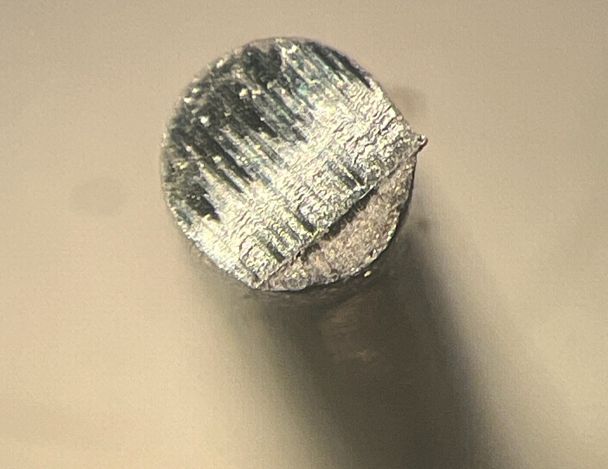
```

Data collected at crime scenes lack the known ground truth needed to estimate error rates; therefore, controlled studies are needed.
In this study, we provide a publicly available dataset of wire-cut scans together with a systematic quantitative processing and comparison workflow.
The shared materials include raw scans, metadata, manually extracted profiles, processed signals, pairwise cross-correlation function (CCF) values, derived images, and analysis code.


The Methods section describes sample collection, scanning, profile extraction, signal processing, and CCF-based alignment.
Data Records describes the shared files and repository organization.
Data Overview presents descriptive summaries of pairwise CCF values.
Technical Validation assesses signal-processing and alignment behavior and variability across replicates, stagings, and acquisitions.
Usage Notes provides practical guidance for working with the shared files, and Code Availability identifies the custom processing and validation code.
The dataset and workflow may support future quantitative research on wire-cut evidence.


# Methods {#sec-methods .unnumbered}

We used five Kaiweets KWS-105 multipurpose tools with 0.5-inch carbon-steel cutting blades to cut 16-gauge anodized pure-aluminum wire.

While aluminum is not commonly used for electric wiring because of its poor conductivity, we chose aluminum for its nontoxicity and suitability for receiving cutting marks and retaining them during subsequent handling.
Pure aluminum has a Brinell hardness of approximately 15 HB, which places it between lead (approximately 5 HB) and copper (approximately 35 HB).


## Scan acquisition {#sec-cutting-wires .unnumbered}

The blades for each of the five wire cutters were labeled A, B, C, and D (see @fig-cut-tent-scan (a)).
B opposes A; the reverse sides are labeled D for A and C for B.
Three locations on each blade were marked (inner, middle, and outer), as shown in @fig-cut-tent-scan (a).
Each four-inch wire segment was cut in half, creating two cut sides, AB and CD.
Note that the cut surface of the wire is not flat, but reveals under the microscope a roof-like structure with the ridge separating the markings from each blade, see @fig-cut-microscope.
Each roof side was then scanned twice separately, yielding scans A and B from cut side AB and C and D from cut side CD.
An example of the four scans resulting from cut 1 by tool 1 are shown in @fig-cut-tent-scan (c).

We scanned the cut surfaces at 20$\times$ magnification using a Sensofar confocal microscope, shown in @fig-cut-tent-scan (b).
The scans were exported in \texttt{x3p} format (ISO 25178-72:2017/Amd 1:2020) with a lateral resolution of 0.645 $\times$ 0.645 micrometers per pixel and a vertical resolution of 0.1 micrometer.

The complete design therefore consists of 5 tools $\times$ 3 locations $\times$ 2 replicates $\times$ 4 cut surfaces = 120 scans.

:::: {#fig-cut-tent-scan layout="[29, -2, 69]" fig-pos="hbt"}

:::{}

\vspace{0pt}

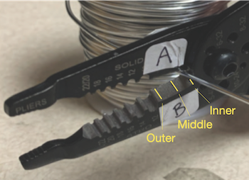{#fig-plier-tip height=16%}

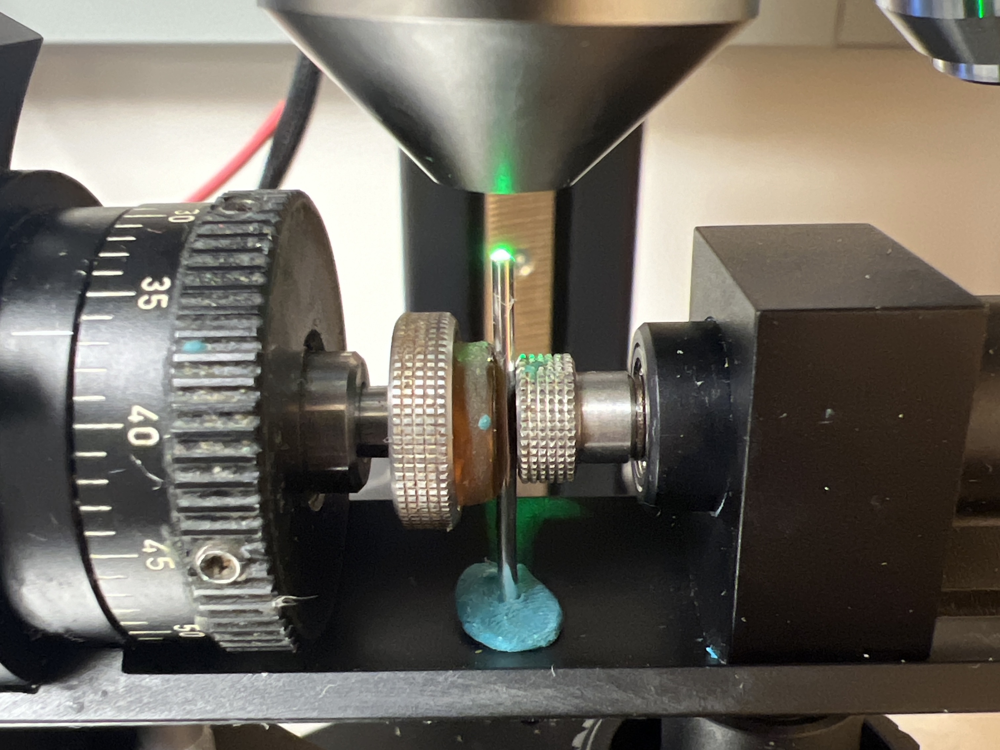{#fig-wire-microscope height=16%}

:::

:::{}

\vspace{0pt}

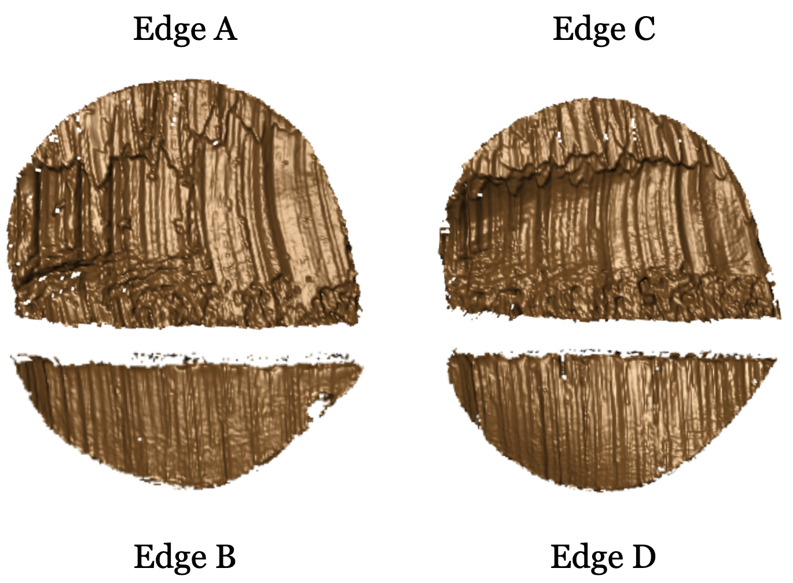{#fig-T1AW-LI-R2-4edges height=40%}
:::

Wire-cut sampling and scanning workflow.
\(a) A Kaiweets KWS-105 wire cutter with inner, middle, and outer locations marked.
(b) A confocal microscope used to scan wire-cut surfaces.
(c) Four scans of cutting marks labeled corresponding to cutting edges A, B, C, and D.

::::

The naming of each piece included the specific tool, its edge, location, and replicate according to the following convention:

\begin{samepage}
\begin{verbatim}
T__W-L_-R_
 ||   |  |
 ||   |  +-- Replicate: 1 or 2
 ||   +----- Location: I (inner), M (middle), or O (outer)
 |+--------- Edge: A, B, C, or D
 +---------- Tool: 1, 2, 3, 4, or 5
\end{verbatim}
\end{samepage}

For example, T1AW-LI-R1 denotes the first replicate of a piece cut with edge A of tool 1 at the inner location.

To minimize errors during data collection, two team members cut and labeled the wire pieces together.
One team member then scanned the wire cuts and assigned names to the scans as described.


## Signal extraction {#sec-extract-profiles .unnumbered}

Signals are extracted from each surface scan using a two-step procedure. First, a representative profile is identified along a line across the surface perpendicular to the dominant striation direction. This line is chosen manually such that it avoids artifacts from the scanning (e.g. holes) and cutting (e.g. rips from rolling wires).
Along this line surface values are assigned at equi-spaced positions corresponding to the observed value at the closest position on the surface grid.

<!-- (see sketch at images/extract-profile-line.png).  -->

<!-- 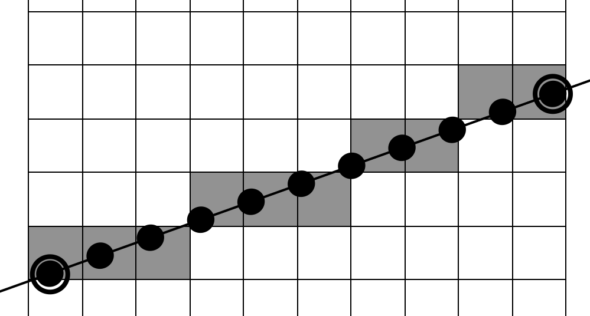 -->

:::: {#fig-T1AW-LI-R1-profiles-signals layout="[45, 55]" fig-pos="hbt"}

:::{}

\vspace{0pt}

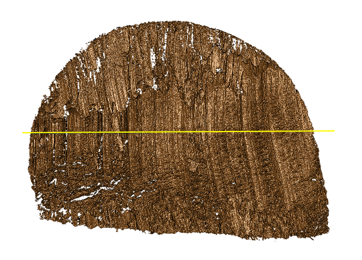{#fig-T1AW-LI-R1-profiles height=37%}

:::

:::{}

\vspace{0pt}

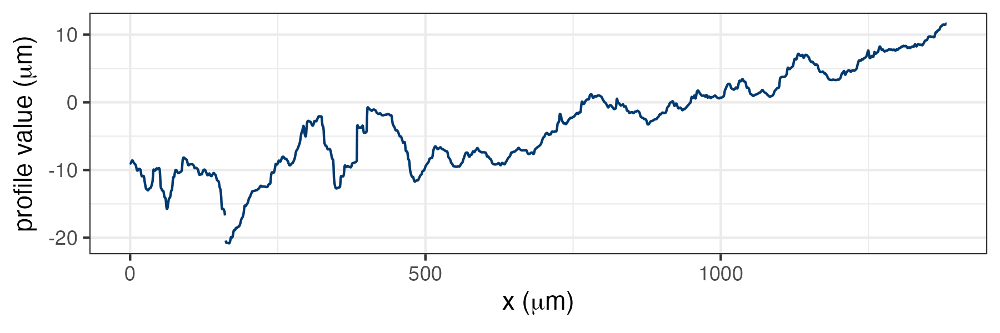{#fig-T1AW-LI-R1-profiles-plot height=16%}

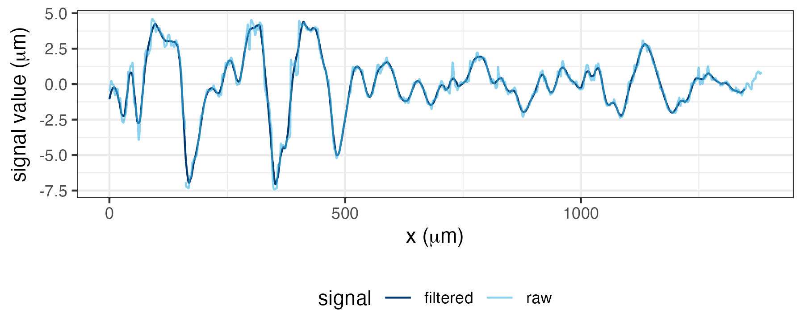{#fig-T1AW-LI-R1-signals-plot height=16%}
:::

Profile and signal extraction.
\(a) A dark-blue profile line drawn across the scan striations.
(b) The profile function extracted along the line in (a).
(c) Raw and filtered signals obtained from the profile function in (b).

::::


In a second step, we extract the scan's signal by removing trends and outliers from the surface values of the profile with the help of two LOWESS filters with bandwidths of 400 $\mu m$ and 40 $\mu m$, respectively [@clevelandLocalRegressionModels1992].
All smoothers are susceptible to boundary issues, particularly, when outliers are present.
Steep changes at the end of a signal have a high potential to attract another signal causing mis-alignments.
To avoid the potential of artificial 'hooks' at either end of a signal, we use a two-sample $t$-test over the surface values for the two outermost intervals of 2.5\% along the horizontal axis, ie we create summary statistics (sample size, mean, and standard deviation) of the signals within the intervals $[0, 2.5)%, [2.5, 5)%$ and $(95, 97.5]%, (97.5, 100]%$ and only keep the signal of the outermost  intervals if the corresponding $t$-statistics stays above a $p$-value of 0.01, ie does not indicate a significant shift.

The widths of these intervals correspond to the choice of bandwidths and the length of the signal and were determined using cross-validation. 

<!-- the diameter of a 16-gauge wire corresponds to 1.2 $mm$ or 1200 $\mu m$. At a lateral resolution of 0.645 $\mu m$ per pixel, 2.5% of the signal correspond to a length of about 20-30 $\mu m$. Since this is well within the number of values used for the outlier filter, trend removal and outlier filter can create artificial hooks.    -->


<!-- To prevent subsequent issues with extreme deviations at either end of the signal, we -->
<!-- created summaries (sample size, mean, and standard deviation) of the signals for the two outermost intervals of 2.5\% along the horizontal axis.  -->
<!-- We then checked for extreme deviations at the ends of the signal. -->
<!-- The horizontal coordinates were divided at the 0\%, 2.5\%, 5\%, 95\%, 97.5\%, and 100\% quantiles. -->
<!-- At each end, a two-sample t-test compared the outermost 2.5\% interval with the adjacent interval. -->
<!-- When the boundary two-sample t-test produced a p-value below 0.01, values in the outermost interval were removed. -->

The resulting signal was used for subsequent comparisons with other signals.

An example profile line is shown in dark blue in @fig-T1AW-LI-R1-profiles-signals (a), and the resulting profile function is plotted in @fig-T1AW-LI-R1-profiles-signals (b).

@fig-T1AW-LI-R1-profiles-signals (c) shows the resulting smoothed signal.


<!-- Based on the \texttt{x3p} files, representative profiles from the scans were extracted. -->
<!-- A profile is a sequence of surface-height values along a user-drawn line. -->
<!-- After processing, each profile became a signal representing one scan and was used for subsequent comparisons. -->

\hh{do we have a code file? we should refer to that instead of the functions in R we used}

Using `x3ptools::x3p_extract_profile`, we manually drew one line across each scan, perpendicular to the dominant striation direction, and exported the surface-height values and extraction coordinates.

One profile for each scan is included as a csv file in the repository using the same naming convention as the scans, with the precursor of `profiles-`. 
\hh{More details on the exact format of these files are provided below.}

\hh{Code to create signals from profiles is available in code/4-create\_signals\_from_profiles.R}


<!-- ## Filtered signals {#sec-filtered-signals .unnumbered} -->


<!-- After extracting each profile, we applied a two-span smoothing procedure, with span parameters of 400 and 40 controlling removal of the broad trend and smoothing of local variation, respectively [@clevelandLocalRegressionModels1992]. -->
<!-- We then checked for extreme deviations at the ends of the signal. -->
<!-- The horizontal coordinates were divided at the 0\%, 2.5\%, 5\%, 95\%, 97.5\%, and 100\% quantiles. -->
<!-- At each end, a two-sample t-test compared the outermost 2.5\% interval with the adjacent interval. -->
<!-- When the boundary two-sample t-test produced a p-value below 0.01, values in the outermost interval were removed. -->
<!-- The resulting smoothed signal was used for subsequent comparisons. -->
<!-- @fig-T1AW-LI-R1-profiles-signals (c) shows the resulting smoothed signal. -->


## Align signals {#sec-align-signals .unnumbered}


After extracting signals from different scans, we compared all possible signal pairs.
For each pair, we calculated the CCF across relative shifts and retained the shift with the maximum CCF as the optimal alignment.
The comparison between T1AW-LI-R1 and T1AW-LI-R2, for example, corresponds to a row in @fig-scans-pair.
The first two columns of @fig-signals-pair-alignment show the extracted signals, and the rightmost column shows their alignment and CCF value.

```{r}
#| echo: false
#| out.width: "557px"
#| label: fig-scans-pair
#| fig-pos: hbt
#| fig-cap: >-
#|   Same-source replicate scan pairs.
#|   Each row shows the two replicate scans for one cut surface (A, C, B, or D) from tool 1 at the inner blade location.
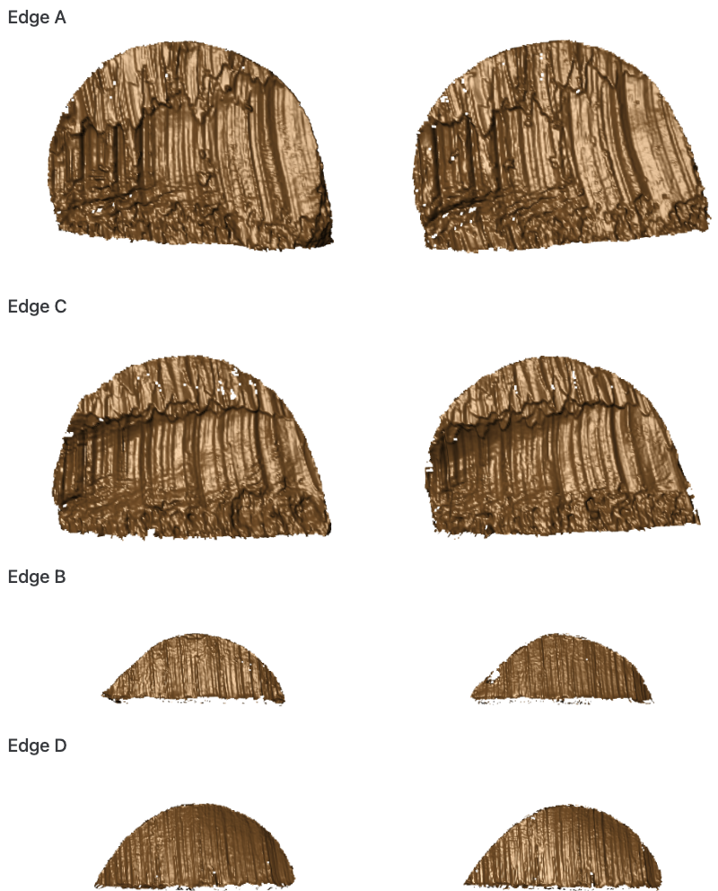

```


```{r}
#| echo: false
#| out.width: "500px"
#| fig-pos: hbt
#| label: fig-signals-pair-alignment
#| fig-cap: >-
#|   Same-source signal alignment.
#|   Rows correspond to cut surfaces A, C, B, and D.
#|   The first two columns show signals extracted from the replicate scans in @fig-scans-pair; the third column overlays the aligned signals and reports their CCF values.
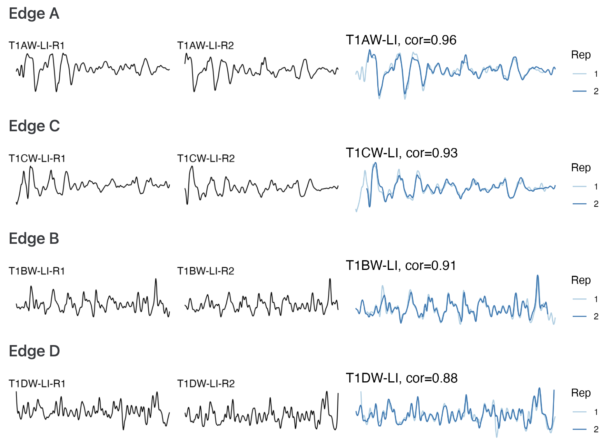
```


# Data Records {#sec-data-records .unnumbered}


\agentrevision{The complete dataset, including the \texttt{x3p} scans, metadata, extracted profiles, processed signals, pairwise CCF values, and derived images, is available from Iowa State University DataShare [DATASET CITATION] at \url{https://doi.org/[DOI]}.}
\agentformat{Replace the dataset citation and DOI placeholders.
For first-round review, the destination must permit anonymous download; from the second round onward, it must be a public formal repository record.
Add the full dataset reference to References.}
The repository contents, formats, and folder organization are summarized in @tbl-data-overview.


```{r}
#| echo: FALSE
#| label: tbl-data-overview
#| tbl-cap: Structure of available data and files.
#| results: asis

gt_table <- tibble(
  group_type = c(rep("Raw data", 2), rep("Manual derivatives", 1), rep("Computational derivatives in the folder 'data-derived/'", 2), rep("Image files", 2), "Visual inventory in the folder 'assessment/analysis-manual/'", "Technical validation"),
  data_type = c("`scans/`", "`meta.csv`", "`profiles/`", "`wire-signals`", "`wire_pairwise_ccf`", "`pngs/`", "`profile-images/`", "`processing-wires`", "`variability-`\n`assessment/`"),
  Description = c("folder containing 120 topographic 3D scans corresponding to 30 aluminum wire cuts (`x3p` format)", "metadata for each cut, including tool, blade, and location information (CSV format)", "folder containing manually extracted profiles (CSV format)", "signals processed from the corresponding profiles (zipped CSV format)", "CCF values for all pairwise aligned signals (zipped CSV format)", "folder containing images of 3D wire-cut scans (PNG format)", "folder containing images of profiles extracted from wire cuts (PNG format)", "display of pairwise aligned signals from the same sources (HTML format)", "folder containing technical-validation documents, with an internal structure that mirrors the main folder"),
  Section = c("Cutting wires", "Cutting wires", "Extract profiles", "Filtered signals", "Align signals", "Cutting wires", "Extract profiles", "Align signals", "Technical Validation")
) %>%
  group_by(group_type) %>%
  gt(rowname_col = "data_type") %>%
  tab_stubhead(label = "Data type") %>%
  tab_options(table.width = pct(97), table.font.size = px(14.67)) %>%
  cols_width(data_type ~ pct(25), Description ~ pct(60), Section ~ pct(15), everything() ~ pct(20)) %>%
  fmt_markdown()
# gt_table contains the markdown version of the table the way it is supposed to look.
# the errors get introduced in the as_latex function

string <- gt_table %>% as_latex()

# # column widths code - start
# # has bug: column Description is not being recognized, last section is the widest
# # bug fix: it seems, that this is a shift in the column numbers:
# # - description width is controlled by data_type.
# # - Section width is controlled by Description.
dimexprs <- str_extract_all(pattern = "dimexpr 0.[0-9]+", string[1])[[1]]
# the dimension expressions have now changed to
# "dimexpr 0.19" "dimexpr 0.24" "dimexpr 0.58"
# replace these with
replacement <- paste("dimexpr", c(0.26, 0.56, 0.18))
string[1] <- str_replace_all(pattern = "dimexpr 0.[0-9]+", replacement = "dimexpr FIX", string[1])
# replace one by one
for (i in seq_along(dimexprs)) {
  string[1] <- str_replace(string[1], "dimexpr FIX", replacement[i])
}
# column width - end

string
```

\agentrevision{A data dictionary defining non-obvious columns in \texttt{meta.csv}, the profile and signal files, and the pairwise-CCF file is provided in [repository documentation path].
The dataset is available under the [license] license.}
\agentformat{Verify Table 1 against the deposited record and replace the documentation-path and data-license placeholders.
For this non-sensitive original dataset, use CC0 or CC BY rather than a license containing NC or SA restrictions.}


# Data Overview {#sec-data-overview .unnumbered}


As descriptive summaries of comparison behavior across the dataset, @fig-ccf-tilemap displays pairwise CCF values organized by tool, cut surface, blade location, and replicate.
The main diagonal contains self-comparisons, whereas the off-diagonal cells compare distinct signals.
@fig-ccf-density displays the CCF distributions for same-source and different-source comparisons.


```{r}
#| echo: false
#| out.width: "600px"
#| label: fig-ccf-tilemap
#| fig-cap: >-
#|   Pairwise CCF tile map.
#|   Rows and columns group scans by tool, cut surface, blade location, and replicate.
#|   Orange cells indicate larger CCF values and gray cells indicate smaller values; the inset enlarges the boxed edge-to-edge comparison block.
#| fig-pos: hbt
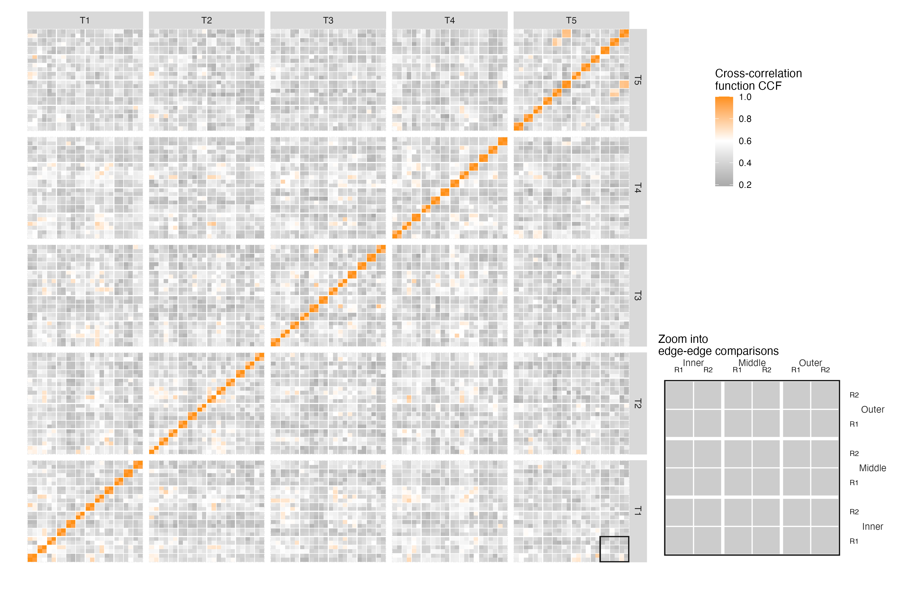
```


```{r}
#| echo: false
#| out.width: "500px"
#| label: fig-ccf-density
#| fig-cap: >-
#|   CCF density distributions.
#|   Kernel density estimates are shown for different-source comparisons in gray and same-source comparisons in orange.
#| fig-pos: hbt
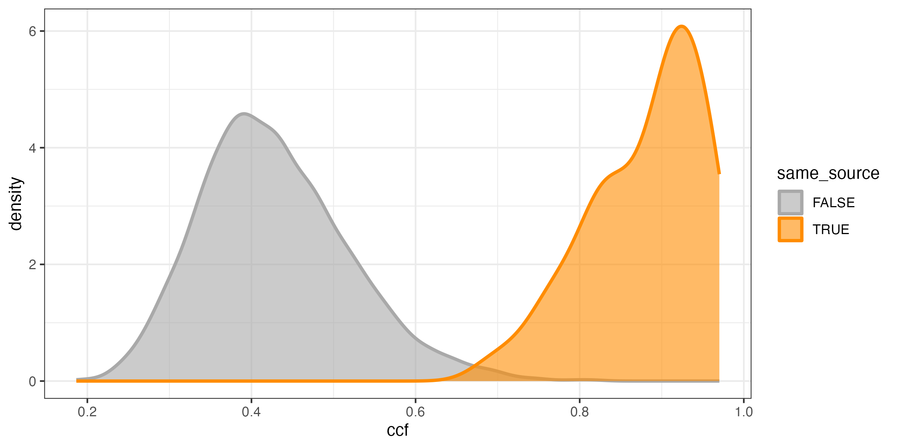
```


# Technical Validation {#sec-technical-validation .unnumbered}


We conducted technical validation in two areas: (1) signal processing and alignment and (2) variability assessment.


We validated scan processing and signal alignment as follows.
We expected high CCF values between signals from the same source and low values between signals from different sources.
@fig-signals-pair-alignment, shown earlier in Align signals, meets our expectation for same-source signals.
As an example of a different-source comparison, we selected T1AW-LI-R1 and T2AW-LI-R1.
@fig-T1AW-LI-R1-T2AW-LI-R1-alignment (a) and (b) show the selected scans.
Their signal alignment, shown in @fig-T1AW-LI-R1-T2AW-LI-R1-alignment (c), has a CCF value of 0.2, which is as low as expected.
For the following summaries, edges A and C were categorized as long, edges B and D as short, and comparisons pairing one long edge with one short edge as mixed.
We also summarized the resulting CCFs for all pairwise comparisons using boxplots and receiver operating characteristic (ROC) curves.
@fig-ccf-boxplot and @fig-ccf-ROC show these summaries.
The ROC curves plot sensitivity, or the true positive rate, against the false positive rate (FPR; 1 - specificity).
The curves are close to the upper-left corner, indicating strong classification performance.
For the combined comparison set, a threshold of 0.589 controls the FPR below 0.05 with a false negative rate (FNR) of 0, whereas a threshold of 0.658 controls the FPR below 0.01 with an FNR of 0.02.
These results are consistent with our expectations and validate our pipeline for processing and aligning signals.


::: {#fig-T1AW-LI-R1-T2AW-LI-R1-alignment layout="[[1, 1], [-0.5, 9, 0.5]]" fig-pos="hbt"}

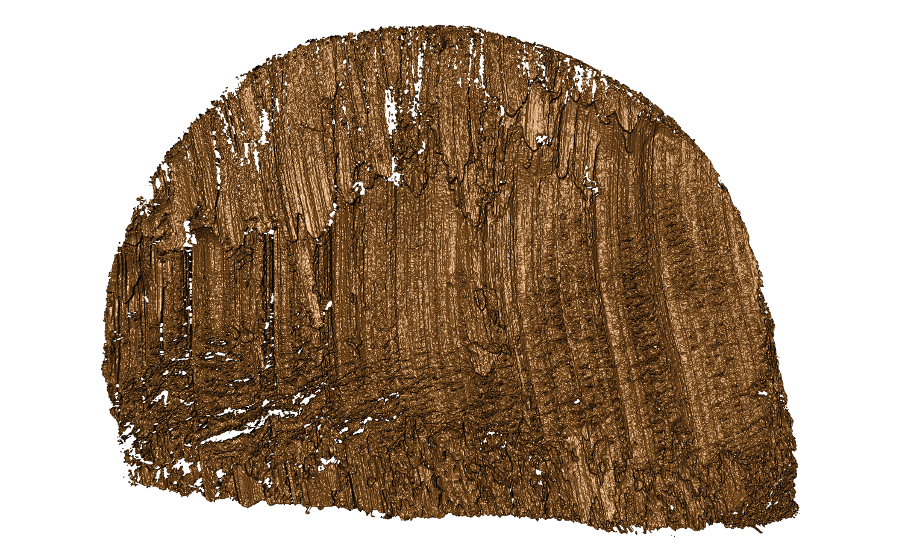{#fig-T1AW-LI-R1 height=5.5cm}

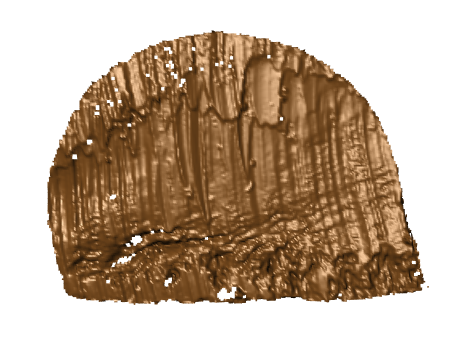{#fig-T2AW-LI-R1 height=5.5cm}

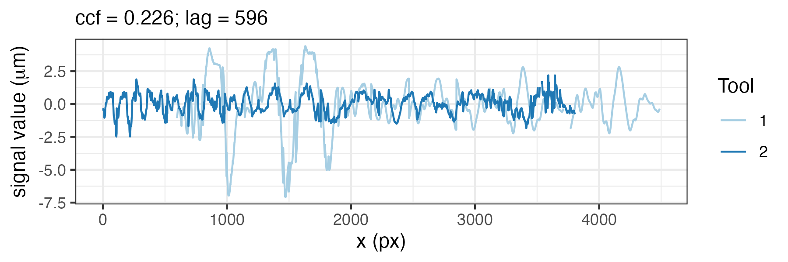{#fig-T1AW-LI-R1-T2AW-LI-R1 height=5cm}

Different-source scan and signal comparison.
\(a) Scan T1AW-LI-R1 cut by tool 1.
(b) Scan T2AW-LI-R1 cut by tool 2.
(c) Alignment of signals from T1AW-LI-R1 and T2AW-LI-R1.

:::


```{r}
#| echo: false
#| out.width: "100%"
#| label: fig-ccf-boxplot
#| fig-pos: hbt
#| fig-cap: >-
#|   CCF distributions across comparison classes.
#|   Gray boxplots show different-source comparisons grouped by different edge, location, or tool; orange boxplots show same-source comparisons.
#|   Rows distinguish long, mixed, and short edge comparisons.
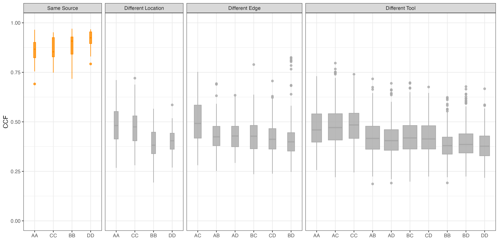
```


```{r}
#| echo: false
#| out.width: "500px"
#| label: fig-ccf-ROC
#| fig-pos: hbt
#| fig-cap: >-
#|   ROC curves for CCF-based classification.
#|   Curves are shown separately for long and short edge classes; the dotted diagonal indicates chance-level classification.
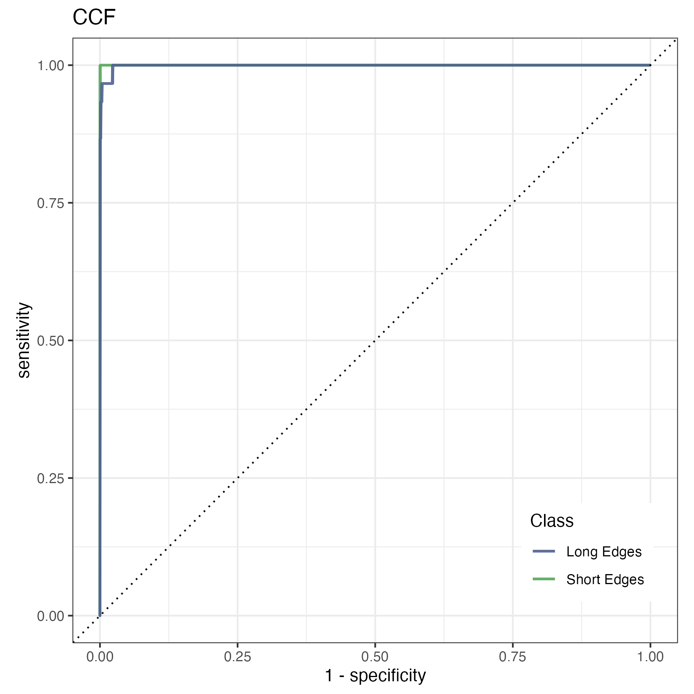
```


The second validation assessed variability in the pipeline across replicates, stagings, and acquisitions.
We selected scans from tool 2 at the middle location for this assessment.
Replicate variability was assessed using two different cuts at the same edge and position.
The comparison in @fig-signals-pair-alignment in Align signals illustrates this assessment.
To assess staging variability, we rescanned replicate 2 under the confocal microscope and introduced the staging label S into the naming protocol.
The S1 designation is omitted from labels, so R2 is equivalent to R2-S1.
For all four edges of tool 2 at the middle location, we created three stagings (R2, R2-S2, and R2-S3), computed pairwise CCFs between stagings, and calculated their mean and standard deviation (SD).


Within each staging, we further examined the effect of different acquisitions by keeping the samples on the confocal microscope while varying the lighting conditions.
We introduced A as the acquisition label.
For edge A at staging 3, we performed four acquisitions and omitted the A1 designation from the first acquisition label.
Therefore, R2-S3 is equivalent to R2-S3-A1.
For the other three edges, we conducted two acquisitions at staging 3.
These acquisitions are denoted by R2-S3 and R2-S3-A2.
Within staging 3, we computed pairwise CCFs between acquisitions and calculated their mean and standard deviation.
Variability between distinct stagings was assessed separately through the staging comparisons described above.


With this setup, we expected CCF values to become more consistent from replicate to staging to acquisition as the scanning conditions became progressively more stable.
Consequently, variability was expected to decrease along this sequence.
We also compared replicates, stagings, and acquisitions, expecting smaller differences between acquisitions and stagings than between stagings and replicates.
We visualized the results as scatter plots.
@fig-rep_staging_acquisition shows the scatter plots and intervals extending two standard deviations above and below the mean.
Higher orange mean lines indicate an increase in the mean CCF, and narrower shaded intervals indicate a decrease in the standard deviation.
The detailed numerical results, including means, standard deviations, and differences between means, are shown in @tbl-CCF-replicate-staging-acquisition and confirm our expectations.


```{r}
#| echo: false
#| out.width: "450px"
#| label: fig-rep_staging_acquisition
#| fig-pos: hbt
#| fig-cap: >-
#|   Variability across scanning conditions.
#|   Panels A, B, C, and D correspond to the four cut surfaces.
#|   Gray points show pairwise CCF values, orange horizontal lines show means, and shaded intervals extend two standard deviations above and below each mean.
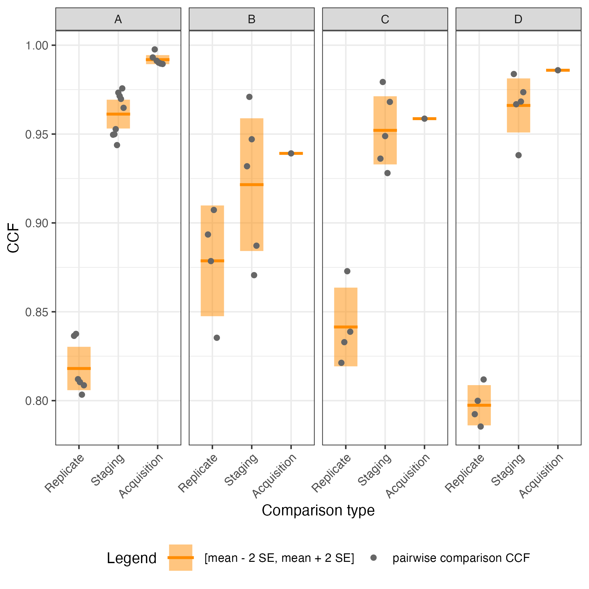
```

\agentformat{The manuscript contains 11 figures.
Scientific Data recommends no more than eight but does not mandate this limit.
Confirm with the coauthors or professor whether any logically connected pairs should be combined for revised submission; do not remove a figure or its discussion without an author decision.}


::: {#tbl-CCF-replicate-staging-acquisition tbl-cap="Comparison of CCF means and standard deviations across different replicates, stagings, and acquisition settings.
Dashes indicate that the standard deviation is undefined because only one CCF value is available."}

\centering
\begin{tabular*}{\linewidth}{@{\extracolsep{\fill}}lrrrrrrrr@{}}
\toprule
 & \multicolumn{2}{c}{\textbf{Replicate (R)}} 
 & \multicolumn{3}{c}{\textbf{Staging (S)}} 
 & \multicolumn{3}{c}{\textbf{Acquisition (A)}} \\
\cmidrule(lr){2-3} \cmidrule(lr){4-6} \cmidrule(lr){7-9}
\textbf{Edge} 
 & \textbf{Avg$_R$}
 & \textbf{SD$_R$}
 & \textbf{Avg$_S$}
 & \textbf{SD$_S$}
 & \textbf{Avg$_S$ - Avg$_R$} 
 & \textbf{Avg$_A$} 
 & \textbf{SD$_A$}
 & \textbf{Avg$_A$ - Avg$_S$} \\
\midrule
A & 0.818 & 0.015 & 0.961 & 0.012 & 0.143 & 0.992 & 0.003 & 0.031 \\
B & 0.879 & 0.031 & 0.922 & 0.042 & 0.043 & 0.939 & --- & 0.017 \\
C & 0.841 & 0.022 & 0.952 & 0.021 & 0.111 & 0.959 & --- & 0.007 \\
D & 0.797 & 0.011 & 0.966 & 0.017 & 0.169 & 0.986 & --- & 0.020 \\
\bottomrule
\end{tabular*}

:::


Our variability assessment does not include variation in CCF values caused by differences in the manual extraction of profiles from scans.
To support reproduction of the results reported here, we have included the extraction locations and values for each scan.


# Usage Notes {#sec-usage-notes .unnumbered}


The raw surface scans are provided in \texttt{x3p} format.
To inspect or process these files in R, use the \texttt{x3ptools} package and its reference manual, available from CRAN [@hofmannX3ptoolsToolsWorking2018].
The \texttt{meta.csv} file links each scan to its tool, edge, blade location, and replicate identifiers.
The supplied profiles and processed signals provide a starting point for users who do not wish to repeat manual profile extraction.
The supplied extraction coordinates allow these derived files to be related back to the corresponding scans.
Because each supplied signal is based on a manually selected profile, users assessing sensitivity to profile placement should re-extract profiles from the raw \texttt{x3p} scans using alternative documented locations.


# Data Availability {#sec-data-availability .unnumbered}

\agentrevision{The data described in this Data Descriptor are available from Iowa State University DataShare [DATASET CITATION] at \url{https://doi.org/[DOI]}.}
\agentformat{Replace the dataset citation and DOI placeholders with the same record used in Data Records.}


# Code Availability {#sec-code-availability .unnumbered}


We used custom R code to inspect raw scans, extract profiles, derive signals, align signals, and generate the validation outputs.
The code is available in the \texttt{assessment/code} folder at \url{https://github.com/heike/wirecuts-data}.
\agentformat{For permanent access, archive the exact code release in a DOI-providing repository and cite it if feasible; Scientific Data recommends combining GitHub with a DOI archive.}
The files and their roles are described in @tbl-code-overview.

```{r}
#| echo: FALSE
#| label: tbl-code-overview
#| tbl-cap: Overview of available code.
#| results: asis

code_files <- c(
  "1-create_pngs_from_x3p.R",
  "2-create_profiles_from_x3p.R",
  "3-create-single-profile-file.R",
  "4-create_signals_from_profiles.R",
  "5-create-images.R",
  "6-align-pairwise.R",
  "7-all-comparison-results.R"
)

string <- tibble(
  group_type = c(rep("Inspect raw scans", 1), rep("Extract profiles", 2), rep("Derive signals", 1), rep("Align signals", 3)),
  code_type = paste0("`", code_files, "`"),
  Description = c("obtain images of `x3p` files in `scans/`", "manually extract profiles from each scan", "create meta profile information", "derive signals from each profile", "create images for pairwise alignment", "compute pairwise alignment CCF values", "visualize comparison results"),
  Section = c("Cutting wires", "Extract profiles", "Extract profiles", "Filtered signals", "Align signals", "Align signals", "Align signals")
) %>%
  gt(rowname_col = "code_type", groupname_col = "group_type") %>%
  tab_stubhead(label = "Code") %>%
  tab_options(table.width = pct(95), table.font.size = px(14.67)) %>%
  cols_width(Description ~ pct(45), Section ~ pct(30), everything() ~ pct(55)) %>%
  fmt_markdown() %>%
  as_latex()

# column widths code - start
# Keep the three generated columns within the 95% table width.
dimexprs <- str_extract_all(pattern = "dimexpr 0.[0-9]+", string[1])[[1]]
replacement <- paste("dimexpr", c(0.43, 0.31, 0.21))
string[1] <- str_replace_all(
  string[1],
  pattern = "dimexpr 0.[0-9]+",
  replacement = "dimexpr FIX"
)
for (i in seq_along(dimexprs)) {
  string[1] <- str_replace(string[1], "dimexpr FIX", replacement[i])
}

# Allow long monospaced filenames to wrap without changing table font size.
for (code_file in code_files) {
  escaped_file <- str_replace_all(code_file, "_", "\\\\_")
  string[1] <- str_replace(
    string[1],
    fixed(paste0("\\texttt{", escaped_file, "}")),
    fixed(paste0("\\path{", code_file, "}"))
  )
}
# column widths code - end

string
```

The provided code reproduces the processing, comparison, validation, and visualization outputs described in Methods and Technical Validation.
\agentrevision{The workflow was run using R [version] and \texttt{x3ptools} [version].
Versions of additional R packages are recorded in [environment file or repository documentation path].}
\agentformat{Replace the R, \texttt{x3ptools}, and environment-record placeholders after checking the analysis environment.}
